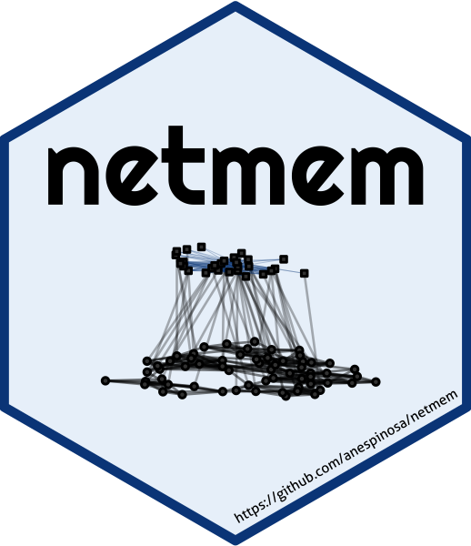

<!-- README.md is generated from README.Rmd. Please edit that file -->

```{r, include = FALSE}
knitr::opts_chunk$set(
  collapse = TRUE,
  comment = "#>",
  fig.path = "man/figures/README-",
  out.width = "100%"
)
```

# netmem: Network Measures using Matrices 

<!-- badges: start -->
[](https://CRAN.R-project.org/package=netmem)
[](https://www.tidyverse.org/lifecycle/#experimental)
[](https://travis-ci.com/anespinosa/netmem)
[](https://ci.appveyor.com/project/anespinosa/netmem)
[](https://codecov.io/gh/anespinosa/netmem?branch=master)
[](https://www.gnu.org/licenses/gpl-3.0)
<!--  -->
<!-- badges: end -->

The goal of [`netmem`](https://anespinosa.github.io/netmem/) is to make available different measures to analyse and manipulate complex networks using matrices.

`r emo::ji("pen")` Author/mantainer: [Alejandro Espinosa-Rada](https://github.com/anespinosa) 

`r emo::ji("school")` [Social Networks Lab ETH Zürich](https://sn.ethz.ch)

[](https://twitter.com/aespinosarada)


The package implements different measures to analyse and manipulate complex multilayer networks, from an ego-centric perspective, considering one-mode networks, valued ties (i.e. *weighted* or *multiplex*) or with multiple levels.

## Citation

```{r echo=FALSE, results='asis'}
citation(package="netmem")
```

## All functions

Functions currently available in [`netmem`](https://anespinosa.github.io/netmem/reference/index.html):

1. `citation_norm()`: Citation networks
2. `clique()`: Find cliques
3. `coocurrence()`: Co‐occurrence
4. `dyadic_census()`: Dyadic census
5. `eb_constraint()`: Constraint
6. `ego_net()`: Ego network
7. `ei_index()`: Krackhardt and Stern's E-I index
8. `gen_degree()`: Generalized degree
9. `gen_density()`: Generalized density
10. `heterogeneity()`: Blau's and IQV Index
11. `jaccard()`: Jaccard similarity
12. `k_core()`: Generalized K-core
13. `kp_reciprocity()`: Reciprocity of Katz and Powell
14. `matrix_to_edgelist()`: Transform symmetric matrix to an edge-list
15. `mixMatrix()`: Mixing matrix
16. `mixed_census()`: Multilevel triad and quadrilateral census
17. `multilevel_degree()`: Degree centrality for multilevel networks.
18. `multiplex_census()`: Multiplex triad census
19. `redundancy()`: Redundancy measures
20. `structuralNA()`: Structural missing data
21. `triad_uman()`: Triad census analysis assuming U|MAN
22. `z_arctest()`: Z test of the number of arcs
23. `zone_sample()`: Zone-2 sampling from second-mode

Data currently available in [`netmem`](https://anespinosa.github.io/netmem/reference/index.html):

1. `FIFAego`: Ego FIFA
2. `FIFAex`: Outside FIFA
3. `FIFAin`: Inside FIFA
4. `krackhardt_friends`: Krackhardt friends

Additional data in [`classicnets: Classic Data of Social Networks`](https://github.com/anespinosa/classicnets)

## Installation

You can install the development version from [GitHub](https://github.com/) with:

```{r inst, eval=FALSE}
# install.packages("devtools")
devtools::install_github("anespinosa/netmem")
```

```{r inst2}
library(netmem)
```

-----

## Multilevel Networks

Connections between individuals are often embedded in complex structures, which shape actors’ expectations, behaviours and outcomes over time. These structures can themselves be interdependent and exist at different levels. Multilevel networks are a means by which we can represent this complex system by using nodes and edges of different types. Check [this book](https://www.springer.com/gp/book/9783319245188) edited by Emmanuel Lazega and Tom A.B. Snijders or [this book](https://www.cambridge.org/core/books/multimodal-political-networks/43EE8C192A1B0DCD65B4D9B9A7842128) edited by David Knoke, Mario Diani, James Hollway and Dimitris Christopoulos.  


For multilevel structures, we tend to collect the data in different matrices representing the variation of ties within and between levels. Often, we describe the connection between actors as an adjacency matrix and the relations between levels through incident matrices. The comfortable combination of these matrices into a common structure would represent the multilevel network that could be highly complex.

### Example

<div class="alert alert-info">
Let's assume that we have a multilevel network with two adjacency matrices, one valued matrix and two incident matrices between them.

- `A1`: Adjacency Matrix of the level 1
- `B1`: Incident Matrix between level 1 and level 2
- `A2`: Adjacency Matrix of the level 2
- `B2`: Incident Matrix between level 2 and level 3
- `A3`: Valued Matrix of the level 3
</div>

Create the data
```{r multilevel_example}
A1 <- matrix(c(0,1,0,0,1,
              1,0,0,1,1,
              0,0,0,1,1,
              0,1,1,0,1,
              1,1,1,1,0), byrow=TRUE, ncol=5)
              
B1 <- matrix(c(1,0,0,
              1,1,0,
              0,1,0,
              0,1,0,
              0,1,1), byrow=TRUE, ncol=3)

A2 <- matrix(c(0,1,1,
              1,0,0,
              1,0,0), byrow=TRUE, nrow=3)

B2 <- matrix(c(1,1,0,0,
              0,0,1,0,
              0,0,1,1), byrow=TRUE, ncol=4)

A3 <- matrix(c(0,1,3,1,
              1,0,0,0,
              3,0,0,5,
              1,0,5,0), byrow=TRUE, ncol=4)
```

What is the density of some of the matrices?
```{r multilevel_example2}
matrices <- list(A1, B1, A2, B2)
gen_density(matrices, multilayer = TRUE)
```

-----

### Ego measures

When we are interested in one particular actor, we could perform different network measures. For example, actor `e` has connections with all the other actors in the network. Therefore, we could estimate some of Ronald Burt's measures.
```{r ego}
# First we will assign names to the matrix
rownames(A1) <- letters[1:nrow(A1)]
colnames(A1) <- letters[1:ncol(A1)]

eb_constraint(A1, ego = "e")
redundancy(A1, ego = "e")
```

Also, sometimes we might want to subset a group of actors surrounding an ego.
```{r ego2}
ego_net(A1, ego = "e")
```

-----


### One-mode network

This package implements the generalized degree centrality. Suppose we consider a valued matrix `A3`. If `alpha=0` then it would only count the direct connections. But, adding the tuning parameter `alpha=0.5` would determine the relative importance of the number of ties compared to tie weights. 

```{r onem}
gen_degree(A3, digraph = FALSE, weighted=TRUE)
```

Also, we could conduct some explorative analysis using the normalized degree of an incident matrix.
```{r onem2}
gen_degree(B1, bipartite = TRUE, normalized=TRUE)
```
 
This package also implement some dyadic analysis
```{r onem3}
# Dyadic census
dyadic_census(A1)

# Katz and Powell reciprocity
kp_reciprocity(A1)

# Z test of the number of arcs
z_arctest(A1)
```

We can also check the triad census assuming conditional uniform distribution considering different types of dyads **(U|MAN)**
```{r onem4}
triad_uman(A1)
```
 

-----

### Multilevel network

Now, we can calculate the degree centrality of the entire structure
```{r multil, warning=FALSE}
multilevel_degree(A1, B1, A2, B2, complete = TRUE)
```

Besides, we can perform a *k*-core analysis of one of the levels using the information of an incident matrix
```{r multil2, warning=FALSE}
k_core(A1, B1, multilevel=TRUE)
```

This package also allows performing complex census for multilevel networks.
```{r multil3}
mixed_census(A2, t(B1), B2, quad=TRUE)
```

-----

### Code of conduct

Please note that this project is released with a [Contributor Code of Conduct](https://anespinosa.github.io/netmem/CODE_OF_CONDUCT.html). By participating in this project you agree to abide by its terms.

-----

### To-do list

```{r todo1}
# library(todor)
# todor::todor_package(c("TODO", "FIXME"))
```
