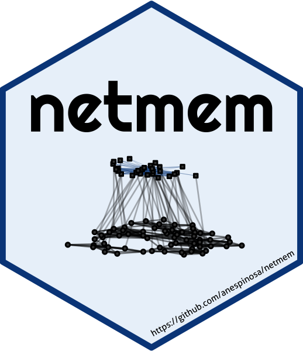
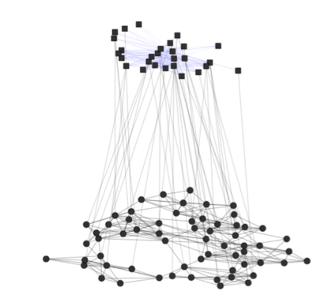

<!-- README.md is generated from README.Rmd. Please edit that file -->

# netmem: Network Measures using Matrices 

<!-- badges: start -->

[](https://CRAN.R-project.org/package=netmem)
[](https://anespinosa.r-universe.dev/netmem)
[](https://github.com/https://github.com/anespinosa/netmem)
[](https://www.tidyverse.org/lifecycle/#experimental)
[](https://codecov.io/gh/anespinosa/netmem?branch=master)
[](https://www.codefactor.io/repository/github/anespinosa/netmem)
[](https://ci.appveyor.com/project/anespinosa/netmem)
[](https://github.com/anespinosa/netmem/actions/workflows/R-CMD-check.yaml)
[](https://www.gnu.org/licenses/gpl-3.0)
[]()
<!-- badges: end -->

The goal of [`netmem`](https://anespinosa.github.io/netmem/) is to make
available different measures to analyse and manipulate complex networks
using matrices.

🖊 Author/mantainer: [Alejandro
Espinosa-Rada](https://www.aespinosarada.com)

🏫 [Current: Institute of Sociology, Pontificia Universidad Católica de
Chile](https://sociologia.uc.cl)

🏫 [Before: Social Networks Lab, ETH Zürich](https://sn.ethz.ch)

[](https://x.com/aespinosarada)

The package implements different measures to analyse and manipulate
complex multilayer networks, from an ego-centric perspective,
considering one-mode networks, valued ties (i.e. *weighted* or
*multiplex*) or with multiple levels.

## Citation

To cite package ‘netmem’ in publications use:

Espinosa-Rada A (2023). *netmem: Social Network Measures using
Matrices*. R package version 1.0-3,
<https://anespinosa.github.io/netmem/>,
<https://github.com/anespinosa/netmem>.

A BibTeX entry for LaTeX users is

@Manual{, title = {netmem: Social Network Measures using Matrices},
author = {Alejandro Espinosa-Rada}, year = {2023}, note = {R package
version 1.0-3, <https://anespinosa.github.io/netmem/>}, url =
{<https://github.com/anespinosa/netmem>}, }

## Functions currently available in [`netmem`](https://anespinosa.github.io/netmem/reference/index.html):

Utilities:

1.  `matrix_report()`: Matrix report

2.  `matrix_adjlist()`: Transform a matrix into an adjacency list

3.  `matrix_projection()`: Unipartite projections

4.  `matrix_to_edgelist()`: Transform a square matrix into an edge-list

5.  `adj_to_matrix()`: Transform an adjacency list into a matrix

6.  `adj_to_incidence()`: Transform an adjacency matrix into a incidence
    matrix

7.  `cumulativeSumMatrices()`: Cumulative sum of matrices

8.  `edgelist_to_matrix()`: Transform an edgelist into a matrix

9.  `expand_matrix()`: Expand matrix

10. `extract_component()`: Extract components

11. `hypergraph()`: Hypergraphs

12. `perm_matrix()`: Permutation matrix

13. `perm_label()`: Permute labels of a matrix

14. `power_function()`: Power of a matrix

15. `meta_matrix()`: Meta matrix for multilevel networks

16. `minmax_overlap()`: Minimum/maximum overlap

17. `mix_matrix()`: Mixing matrix

18. `simplicial_complexes()`: Simplicial complexes

19. `structural_na()`: Structural missing data

20. `ego_net()`: Ego network

21. `zone_sample()`: Zone-2 sampling from second-mode

Ego and personal networks:

1.  `eb_constraint()`: Constraint

2.  `ei_index()`: Krackhardt and Stern’s E-I index

3.  `heterogeneity()`: Blau’s and IQV index

4.  `redundancy()`: Redundancy measures

Path distances:

1.  `bfs_ugraph()`: Breath-first algorithm

2.  `compound_relation()`: Relational composition

3.  `count_geodesics()`: Count geodesic distances

4.  `short_path()`: Shortest path

5.  `wlocal_distances()`: Dijikstra’s algorithm (one actor)

6.  `wall_distances()`: Dijikstra’s algorithm (all actors)

Signed networks:

1.  `posneg_index()`: Positive-negative centrality

2.  `struc_balance()`: Structural balance

Structural measures:

1.  `gen_density()`: Generalized density

2.  `gen_degree()`: Generalized degree

3.  `multilevel_degree()`: Degree centrality for multilevel networks

4.  `recip_coef()`: Reciprocity

5.  `trans_coef()`: Transitivity

6.  `trans_matrix()`: Transitivity matrix

7.  `components_id()`: Components

8.  `k_core()`: Generalized k-core

9.  `dyadic_census()`: Dyad census

10. `multiplex_census()`: Multiplex triad census

11. `mixed_census()`: Multilevel triad and quadrilateral census

Cohesive subgroups:

1.  `clique_table()`: Clique table

2.  `dyad_triad_table()`: Forbidden triad table

3.  `percolation_clique()`: Clique percolation

4.  `q_analysis()`: Q-analysis

5.  `shared_partners()`: Shared partners

Similarity measures:

1.  `bonacich_norm()`: Bonacich normalization

2.  `co_occurrence()`: Co‐occurrence

3.  `dist_sim_matrix()`: Structural similarities

4.  `fractional_approach()`: Fractional approach

5.  `jaccard()`: Jaccard similarity

Network inference:

1.  `kp_reciprocity()`: Reciprocity of Katz and Powell

2.  `z_arctest()`: Z test of the number of arcs

3.  `triad_uman()`: Triad census analysis assuming U\|MAN

4.  `ind_rand_matrix()`: Independent random matrix

Geographic information:

1.  `dist_geographic()`: Geographical distances

2.  `spatial_cor()`: Spatial autocorrelation

Data currently available:

1.  `FIFAego`: Ego FIFA

2.  `FIFAex`: Outside FIFA

3.  `FIFAin`: Inside FIFA

4.  `krackhardt_friends`: Krackhardt friends

5.  `lazega_lawfirm`: Lazega Law Firm

Additional data in
[`classicnets: Classic Data of Social Networks`](https://github.com/anespinosa/classicnets)

------------------------------------------------------------------------

# Quick overview of `netmem: Network Measures using Matrices`

------------------------------------------------------------------------

## Installation

You can install the development version from
[GitHub](https://github.com/) with:

``` r
### OPTION 1
# install.packages("devtools")
devtools::install_github("anespinosa/netmem")

### OPTION 2
options(repos = c(
  netmem = "https://anespinosa.r-universe.dev",
  CRAN = "https://cloud.r-project.org"
))
install.packages("netmem")
```

``` r
library(netmem)
```

------------------------------------------------------------------------

## Multilevel Networks

Connections between individuals are often embedded in complex
structures, which shape actors’ expectations, behaviours and outcomes
over time. These structures can themselves be interdependent and exist
at different levels. Multilevel networks are a means by which we can
represent this complex system by using nodes and edges of different
types. Check [this book](https://www.springer.com/gp/book/9783319245188)
edited by Emmanuel Lazega and Tom A.B. Snijders or [this
book](https://www.cambridge.org/core/books/multimodal-political-networks/43EE8C192A1B0DCD65B4D9B9A7842128)
edited by David Knoke, Mario Diani, James Hollway and Dimitris
Christopoulos.



For multilevel structures, we tend to collect the data in different
matrices representing the variation of ties within and between levels.
Often, we describe the connection between actors as an adjacency matrix
and the relations between levels through incidence matrices. The
comfortable combination of these matrices into a common structure would
represent the multilevel network that could be highly complex.

### Example

<div class="alert alert-info">

Let’s assume that we have a multilevel network with two adjacency
matrices, one valued matrix and two incidence matrices between them.

- `A1`: Adjacency Matrix of the level 1

- `B1`: incidence Matrix between level 1 and level 2

- `A2`: Adjacency Matrix of the level 2

- `B2`: incidence Matrix between level 2 and level 3

- `A3`: Valued Matrix of the level 3

  </div>

Create the data

``` r
A1 <- matrix(c(
  0, 1, 0, 0, 1,
  1, 0, 0, 1, 1,
  0, 0, 0, 1, 1,
  0, 1, 1, 0, 1,
  1, 1, 1, 1, 0
), byrow = TRUE, ncol = 5)

B1 <- matrix(c(
  1, 0, 0,
  1, 1, 0,
  0, 1, 0,
  0, 1, 0,
  0, 1, 1
), byrow = TRUE, ncol = 3)

A2 <- matrix(c(
  0, 1, 1,
  1, 0, 0,
  1, 0, 0
), byrow = TRUE, nrow = 3)

B2 <- matrix(c(
  1, 1, 0, 0,
  0, 0, 1, 0,
  0, 0, 1, 1
), byrow = TRUE, ncol = 4)

A3 <- matrix(c(
  0, 1, 3, 1,
  1, 0, 0, 0,
  3, 0, 0, 5,
  1, 0, 5, 0
), byrow = TRUE, ncol = 4)
```

We will start with a report of the matrices:

``` r
matrix_report(A1)
#> The matrix A might have the following characteristics:
#> --> The vectors of the matrix are `numeric`
#> --> No names assigned to the rows of the matrix
#> --> No names assigned to the columns of the matrix
#> --> Matrix is symmetric (network is undirected)
#> --> The matrix is square, 5 by 5
#>      nodes edges
#> [1,]     5     7
matrix_report(B1)
#> The matrix A might have the following characteristics:
#> --> The vectors of the matrix are `numeric`
#> --> No names assigned to the rows of the matrix
#> --> No names assigned to the columns of the matrix
#> --> The matrix is rectangular, 3 by 5
#>      nodes_rows nodes_columns incidence_lines
#> [1,]          3             5               7
matrix_report(A2)
#> The matrix A might have the following characteristics:
#> --> The vectors of the matrix are `numeric`
#> --> No names assigned to the rows of the matrix
#> --> No names assigned to the columns of the matrix
#> --> Matrix is symmetric (network is undirected)
#> --> The matrix is square, 3 by 3
#>      nodes edges
#> [1,]     3     2
matrix_report(B2)
#> The matrix A might have the following characteristics:
#> --> The vectors of the matrix are `numeric`
#> --> No names assigned to the rows of the matrix
#> --> No names assigned to the columns of the matrix
#> --> The matrix is rectangular, 4 by 3
#>      nodes_rows nodes_columns incidence_lines
#> [1,]          4             3               5
matrix_report(A3)
#> The matrix A might have the following characteristics:
#> --> The vectors of the matrix are `numeric`
#> --> No names assigned to the rows of the matrix
#> --> No names assigned to the columns of the matrix
#> --> Valued matrix
#> --> Matrix is symmetric (network is undirected)
#> --> The matrix is square, 4 by 4
#>      nodes edges
#> [1,]     4    10
```

What is the density of some of the matrices?

``` r
matrices <- list(A1, B1, A2, B2)
gen_density(matrices, multilayer = TRUE)
#> $`Density of matrix [[1]]`
#> [1] 0.7
#> 
#> $`Density of matrix [[2]]`
#> [1] 0.4666667
#> 
#> $`Density of matrix [[3]]`
#> [1] 0.6666667
#> 
#> $`Density of matrix [[4]]`
#> [1] 0.4166667
```

How about the degree centrality of the entire structure?

``` r
multilevel_degree(A1, B1, A2, B2, complete = TRUE)
#>    multilevel bipartiteB1 bipartiteB2 tripartiteB1B2 low_multilevel
#> n1          3           1          NA              1              3
#> n2          5           2          NA              2              5
#> n3          3           1          NA              1              3
#> n4          4           1          NA              1              4
#> n5          6           2          NA              2              6
#> m1          6           2           2              4              4
#> m2          6           4           1              5              5
#> m3          4           1           2              3              3
#> k1          4          NA           1              1              1
#> k2          2          NA           1              1              1
#> k3          3          NA           2              2              2
#> k4          1          NA           1              1              1
#>    meso_multilevel high_multilevel
#> n1               1               1
#> n2               2               2
#> n3               1               1
#> n4               1               1
#> n5               2               2
#> m1               6               4
#> m2               6               5
#> m3               4               3
#> k1               1               1
#> k2               1               1
#> k3               2               2
#> k4               1               1
```

Besides, we can perform a *k*-core analysis of one of the levels using
the information of an incidence matrix

``` r
k_core(A1, B1, multilevel = TRUE)
#> [1] 1 3 1 2 3
```

This package also allows performing complex census for multilevel
networks.

``` r
mixed_census(A2, t(B1), B2, quad = TRUE)
#>   000   100   001   010   020   200  11D0  11U0   120   210   220   002  01D1 
#>     2     6     1     0     0     2     0     0     4     0     1     1     0 
#>  01U1   012   021   022  101N  101P   201   102   202 11D1W 11U1P 11D1P 11U1W 
#>     0     0     8     0     3     0     1     3     1     0     0     0     0 
#>  121W  121P  21D1  21U1  11D2  11U2   221   122   212   222 
#>    11    13     0     0     0     0     3     0     0     0
```

------------------------------------------------------------------------

### Ego measures

When we are interested in one particular actor, we could perform
different network measures. For example, actor `e` has connections with
all the other actors in the network. Therefore, we could estimate some
of Ronald Burt’s measures.

``` r
# First we will assign names to the matrix
rownames(A1) <- letters[1:nrow(A1)]
colnames(A1) <- letters[1:ncol(A1)]

eb_constraint(A1, ego = "e")
#> $results
#>   term1 term2 term3 constraint normalization
#> e  0.25 0.292 0.101      0.642         0.761
#> 
#> $maximum
#>     e 
#> 0.766
redundancy(A1, ego = "e")
#> $redundancy
#> [1] 1.5
#> 
#> $effective_size
#> [1] 2.5
#> 
#> $efficiency
#> [1] 0.625
```

Also, sometimes we might want to subset a group of actors surrounding an
ego.

``` r
ego_net(A1, ego = "e")
#>   a b c d
#> a 0 1 0 0
#> b 1 0 0 1
#> c 0 0 0 1
#> d 0 1 1 0
```

------------------------------------------------------------------------

### One-mode network

This package expand some measures for one-mode networks, such as the
generalized degree centrality. Suppose we consider a valued matrix `A3`.
If `alpha=0` then it would only count the direct connections. But,
adding the tuning parameter `alpha=0.5` would determine the relative
importance of the number of ties compared to tie weights.

``` r
gen_degree(A3, digraph = FALSE, weighted = TRUE)
#> [1] 3.872983 1.000000 4.000000 3.464102
```

Also, we could conduct some exploratory analysis using the normalized
degree of an incidence matrix.

``` r
gen_degree(B1, bipartite = TRUE, normalized = TRUE)
#> $bipartiteL1
#> [1] 0.3333333 0.6666667 0.3333333 0.3333333 0.6666667
#> 
#> $bipartiteL2
#> [1] 0.4 0.8 0.2
```

This package also implements some analysis of dyads.

``` r
# dyad census
dyadic_census(A1)
#>      Mutual Asymmetrics       Nulls 
#>           7           0           3

# Katz and Powell reciprocity
kp_reciprocity(A1)
#> [1] 6.333333

# Z test of the number of arcs
z_arctest(A1)
#>     z     p 
#> 1.789 0.074
```

We can also check the triad census assuming conditional uniform
distribution considering different types of dyads **(U\|MAN)**

``` r
triad_uman(A1)
#>    label OBS   EXP   VAR   STD
#> 1    003   0 0.083 0.076 0.276
#> 2    012   0 0.000 0.000 0.000
#> 3    102   2 1.750 0.688 0.829
#> 4   021D   0 0.000 0.000 0.000
#> 5   021U   0 0.000 0.000 0.000
#> 6   021C   0 0.000 0.000 0.000
#> 7   111D   0 0.000 0.000 0.000
#> 8   111U   0 0.000 0.000 0.000
#> 9   030T   0 0.000 0.000 0.000
#> 10  030C   0 0.000 0.000 0.000
#> 11   201   5 5.250 1.688 1.299
#> 12  120D   0 0.000 0.000 0.000
#> 13  120U   0 0.000 0.000 0.000
#> 14  120C   0 0.000 0.000 0.000
#> 15   210   0 0.000 0.000 0.000
#> 16   300   3 2.917 0.410 0.640
```

------------------------------------------------------------------------

### Code of conduct

Please note that this project is released with a [Contributor Code of
Conduct](https://anespinosa.github.io/netmem/CODE_OF_CONDUCT.html). By
participating in this project you agree to abide by its terms.

------------------------------------------------------------------------

### To-do list

``` r
# library(todor)
# todor::todor_package(c("TODO", "FIXME"))
```

------------------------------------------------------------------------

### Other related R packages

- [`{bipartite}`](https://github.com/biometry/bipartite)

- [`{migraph}`](https://github.com/snlab-ch/migraph)

- [`{multinet}`](https://CRAN.R-project.org/package=multinet)

- [`{muxViz}`](https://github.com/manlius/muxViz)

- [`{tnet}`](https://toreopsahl.com/tnet/)

- [`{xUCINET}`](https://www.analyzingsocialnetworksusingr.com/xucinet)
