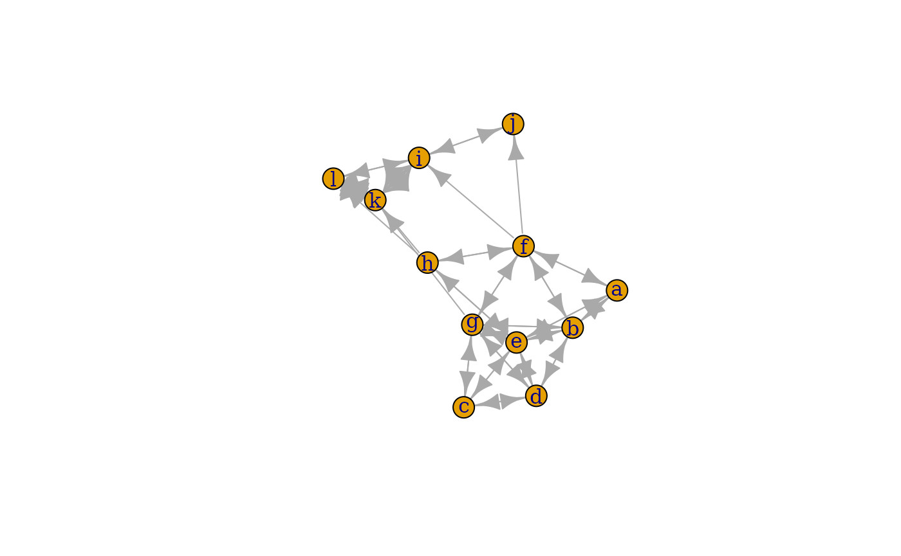
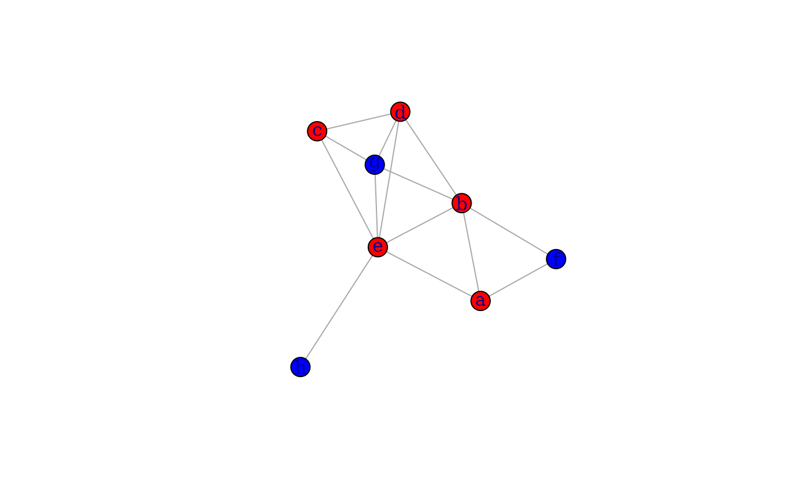
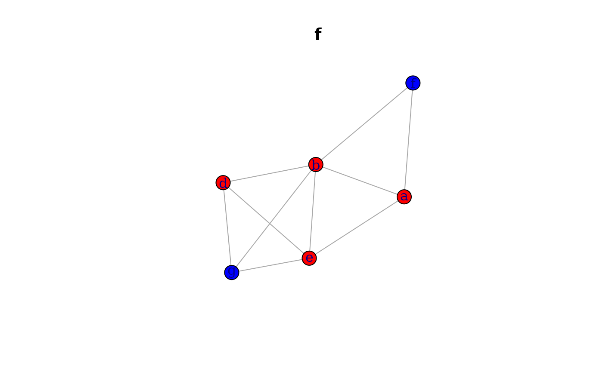
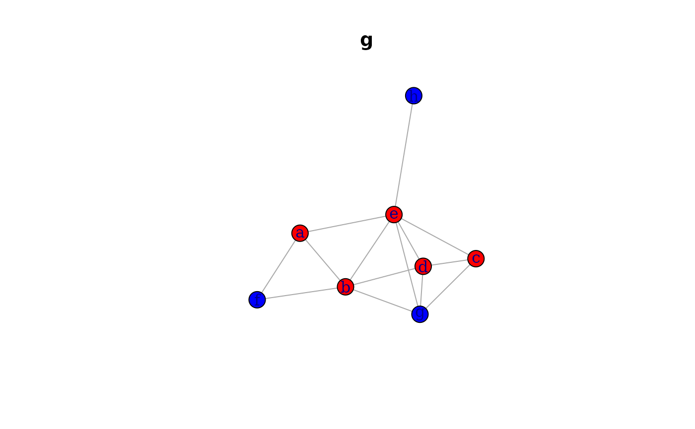
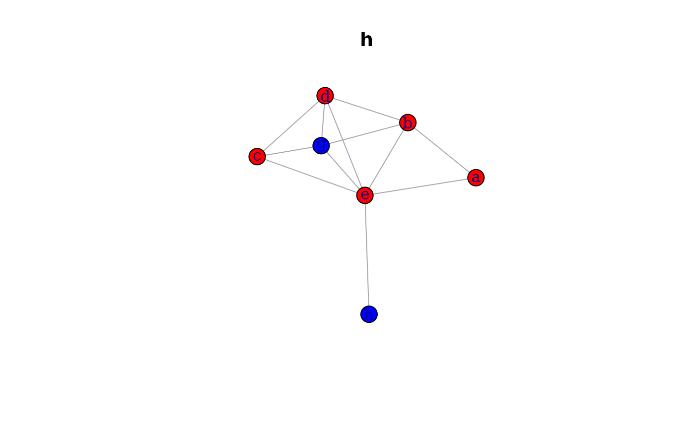

# multilayer

------------------------------------------------------------------------

## Installation

You can install the development version from
[github/anespinosa](https://github.com/anespinosa/netmem):

``` r
# install.packages("devtools")
devtools::install_github("anespinosa/netmem")
```

``` r
library(netmem)
```

------------------------------------------------------------------------

### Multilayers

*Multilayer networks* is a framework that considers complex patterns of
relationships between the same and/or different nodes. However, from a
social network and sociological perspective, different types of
multilayer structures are often referred to as *multiplex networks* (or
*multi-relational*), *multilevel networks*, *network of networks*
[Kivelä et al. (2014)](https://doi.org/10.1093/comnet/cnu016), *two-mode
networks*, among others. Furthermore, and from a matrix perspective, the
‘backbone’ of these complex structures are mainly represented through
the comfortable combination of different types of matrices. The primary
matrix used in social network analysis is the adjacency matrix or
sociomatrix and the incidence matrix.

------------------------------------------------------------------------

### Two-mode networks

There are different ways of referring to incidence matrices. From the
social network perspective is often considered as *affiliation network*,
which consist of a set of binary relationships between members of two
sets of items (i.e., “is a member of” or “is a participant in” or “has”)
([Borgatti and Halgin,
2011](https://methods.sagepub.com/book/the-sage-handbook-of-social-network-analysis/n28.xml)).
In general, these networks have a bipartite property in which there are
two classes such that all ties occur only between classes and never
within classes.

For example, in this section we will use the classical example of the
Southern Woman extracted from the `R` package
[classicnets](https://github.com/anespinosa/classicnets):

``` r
A <- matrix(
  c(
    1, 1, 1, 1, 1, 1, 0, 1, 1, 0, 0, 0, 0, 0,
    1, 1, 1, 0, 1, 1, 1, 1, 0, 0, 0, 0, 0, 0,
    0, 1, 1, 1, 1, 1, 1, 1, 1, 0, 0, 0, 0, 0,
    1, 0, 1, 1, 1, 1, 1, 1, 0, 0, 0, 0, 0, 0,
    0, 0, 1, 1, 1, 0, 1, 0, 0, 0, 0, 0, 0, 0,
    0, 0, 1, 0, 1, 1, 0, 1, 0, 0, 0, 0, 0, 0,
    0, 0, 0, 0, 1, 1, 1, 1, 0, 0, 0, 0, 0, 0,
    0, 0, 0, 0, 0, 1, 0, 1, 1, 0, 0, 0, 0, 0,
    0, 0, 0, 0, 1, 0, 1, 1, 1, 0, 0, 0, 0, 0,
    0, 0, 0, 0, 0, 0, 1, 1, 1, 0, 0, 1, 0, 0,
    0, 0, 0, 0, 0, 0, 0, 1, 1, 1, 0, 1, 0, 0,
    0, 0, 0, 0, 0, 0, 0, 1, 1, 1, 0, 1, 1, 1,
    0, 0, 0, 0, 0, 0, 1, 1, 1, 1, 0, 1, 1, 1,
    0, 0, 0, 0, 0, 1, 1, 0, 1, 1, 1, 1, 1, 1,
    0, 0, 0, 0, 0, 0, 1, 1, 0, 1, 1, 1, 0, 0,
    0, 0, 0, 0, 0, 0, 0, 1, 1, 0, 0, 0, 0, 0,
    0, 0, 0, 0, 0, 0, 0, 0, 1, 0, 1, 0, 0, 0,
    0, 0, 0, 0, 0, 0, 0, 0, 1, 0, 1, 0, 0, 0
  ),
  byrow = TRUE, ncol = 14
)
```

As a common practice, an incidence matrix is often converted to adjacent
matrices. These are given by the matrix product $AA^{T}$ and $A^{T}A$,
where $A$ is the incidence matrix and matrix $A^{T}$ is the transpose of
$A$. The relationship between these matrices in the context of social
networks was explored by [Breiger
(1974)](https://doi.org/10.2307/2576011).

``` r
matrix_projection(A)
#> $matrix1
#>       [,1] [,2] [,3] [,4] [,5] [,6] [,7] [,8] [,9] [,10] [,11] [,12] [,13]
#>  [1,]    3    2    3    2    3    3    2    3    1     0     0     0     0
#>  [2,]    2    3    3    2    3    3    2    3    2     0     0     0     0
#>  [3,]    3    3    6    4    6    5    4    5    2     0     0     0     0
#>  [4,]    2    2    4    4    4    3    3    3    2     0     0     0     0
#>  [5,]    3    3    6    4    8    6    6    7    3     0     0     0     0
#>  [6,]    3    3    5    3    6    8    5    7    4     1     1     1     1
#>  [7,]    2    2    4    3    6    5   10    8    5     3     2     4     2
#>  [8,]    3    3    5    3    7    7    8   14    9     4     1     5     2
#>  [9,]    1    2    2    2    3    4    5    9   12     4     3     5     3
#> [10,]    0    0    0    0    0    1    3    4    4     5     2     5     3
#> [11,]    0    0    0    0    0    1    2    1    3     2     4     2     1
#> [12,]    0    0    0    0    0    1    4    5    5     5     2     6     3
#> [13,]    0    0    0    0    0    1    2    2    3     3     1     3     3
#> [14,]    0    0    0    0    0    1    2    2    3     3     1     3     3
#>       [,14]
#>  [1,]     0
#>  [2,]     0
#>  [3,]     0
#>  [4,]     0
#>  [5,]     0
#>  [6,]     1
#>  [7,]     2
#>  [8,]     2
#>  [9,]     3
#> [10,]     3
#> [11,]     1
#> [12,]     3
#> [13,]     3
#> [14,]     3
#> 
#> $matrix2
#>       [,1] [,2] [,3] [,4] [,5] [,6] [,7] [,8] [,9] [,10] [,11] [,12] [,13]
#>  [1,]    8    6    7    6    3    4    3    3    3     2     2     2     2
#>  [2,]    6    7    6    6    3    4    4    2    3     2     1     1     2
#>  [3,]    7    6    8    6    4    4    4    3    4     3     2     2     3
#>  [4,]    6    6    6    7    4    4    4    2    3     2     1     1     2
#>  [5,]    3    3    4    4    4    2    2    0    2     1     0     0     1
#>  [6,]    4    4    4    4    2    4    3    2    2     1     1     1     1
#>  [7,]    3    4    4    4    2    3    4    2    3     2     1     1     2
#>  [8,]    3    2    3    2    0    2    2    3    2     2     2     2     2
#>  [9,]    3    3    4    3    2    2    3    2    4     3     2     2     3
#> [10,]    2    2    3    2    1    1    2    2    3     4     3     3     4
#> [11,]    2    1    2    1    0    1    1    2    2     3     4     4     4
#> [12,]    2    1    2    1    0    1    1    2    2     3     4     6     6
#> [13,]    2    2    3    2    1    1    2    2    3     4     4     6     7
#> [14,]    2    2    3    2    1    1    2    2    2     3     3     5     6
#> [15,]    1    2    2    2    1    1    2    1    2     3     3     3     4
#> [16,]    2    1    2    1    0    1    1    2    2     2     2     2     2
#> [17,]    1    0    1    0    0    0    0    1    1     1     1     1     1
#> [18,]    1    0    1    0    0    0    0    1    1     1     1     1     1
#>       [,14] [,15] [,16] [,17] [,18]
#>  [1,]     2     1     2     1     1
#>  [2,]     2     2     1     0     0
#>  [3,]     3     2     2     1     1
#>  [4,]     2     2     1     0     0
#>  [5,]     1     1     0     0     0
#>  [6,]     1     1     1     0     0
#>  [7,]     2     2     1     0     0
#>  [8,]     2     1     2     1     1
#>  [9,]     2     2     2     1     1
#> [10,]     3     3     2     1     1
#> [11,]     3     3     2     1     1
#> [12,]     5     3     2     1     1
#> [13,]     6     4     2     1     1
#> [14,]     8     4     1     2     2
#> [15,]     4     5     1     1     1
#> [16,]     1     1     2     1     1
#> [17,]     2     1     1     2     2
#> [18,]     2     1     1     2     2
```

Another concept often used is *bipartite network*, which means that the
graph’s nodes can be partitioned into two classes. While in some cases,
these classes can be different entities (e.g., actors participating in
activities or belonging to clubs), this assumption is not always clear.
For example, dichotomic attributes of ascribed characteristics also have
a bipartite property.

An approach that was devised specifically for affiliation data, was
provided by [Bonacich
(1972)](https://doi.org/10.1080/0022250X.1972.9989806):

``` r
bonacich_norm(A)
#>            [,1]      [,2]      [,3]      [,4]      [,5]      [,6]      [,7]
#>  [1,] 1.0000000 0.7947869 0.8554094 0.7947869 0.6339746 1.0000000 0.6339746
#>  [2,] 0.7947869 1.0000000 0.7947869 0.8571429 0.6796228 1.0000000 1.0000000
#>  [3,] 0.8554094 0.7947869 1.0000000 0.7947869 1.0000000 1.0000000 1.0000000
#>  [4,] 0.7947869 0.8571429 0.7947869 1.0000000 1.0000000 1.0000000 1.0000000
#>  [5,] 0.6339746 0.6796228 1.0000000 1.0000000 1.0000000 0.6666667 0.6666667
#>  [6,] 1.0000000 1.0000000 1.0000000 1.0000000 0.6666667 1.0000000 0.8386095
#>  [7,] 0.6339746 1.0000000 1.0000000 1.0000000 0.6666667 0.8386095 1.0000000
#>  [8,] 1.0000000 0.6077190 1.0000000 0.6077190 0.0000000 0.7500000 0.7500000
#>  [9,] 0.6339746 0.6796228 1.0000000 0.6796228 0.6666667 0.6666667 0.8386095
#> [10,] 0.4494897 0.5000000 0.6339746 0.5000000 0.4686270 0.4686270 0.6666667
#> [11,] 0.4494897 0.3203772 0.4494897 0.3203772 0.0000000 0.4686270 0.4686270
#> [12,] 0.2898979 0.2052131 0.2898979 0.2052131 0.0000000 0.3660254 0.3660254
#> [13,] 0.2052131 0.2857143 0.3538894 0.2857143 0.3203772 0.3203772 0.5000000
#> [14,] 0.0000000 0.2052131 0.2572843 0.2052131 0.2742919 0.2742919 0.4494897
#> [15,] 0.2108967 0.4220645 0.3660254 0.4220645 0.4142136 0.4142136 0.6043561
#> [16,] 1.0000000 0.5000000 1.0000000 0.5000000 0.0000000 0.6339746 0.6339746
#> [17,] 0.4580399 0.0000000 0.4580399 0.0000000 0.0000000 0.0000000 0.0000000
#> [18,] 0.4580399 0.0000000 0.4580399 0.0000000 0.0000000 0.0000000 0.0000000
#>            [,8]      [,9]     [,10]     [,11]     [,12]     [,13]     [,14]
#>  [1,] 1.0000000 0.6339746 0.4494897 0.4494897 0.2898979 0.2052131 0.0000000
#>  [2,] 0.6077190 0.6796228 0.5000000 0.3203772 0.2052131 0.2857143 0.2052131
#>  [3,] 1.0000000 1.0000000 0.6339746 0.4494897 0.2898979 0.3538894 0.2572843
#>  [4,] 0.6077190 0.6796228 0.5000000 0.3203772 0.2052131 0.2857143 0.2052131
#>  [5,] 0.0000000 0.6666667 0.4686270 0.0000000 0.0000000 0.3203772 0.2742919
#>  [6,] 0.7500000 0.6666667 0.4686270 0.4686270 0.3660254 0.3203772 0.2742919
#>  [7,] 0.7500000 0.8386095 0.6666667 0.4686270 0.3660254 0.5000000 0.4494897
#>  [8,] 1.0000000 0.7500000 0.7500000 0.7500000 0.6516685 0.6077190 0.5635083
#>  [9,] 0.7500000 1.0000000 0.8386095 0.6666667 0.5505103 0.6796228 0.4494897
#> [10,] 0.7500000 0.8386095 1.0000000 0.8386095 0.7257081 1.0000000 0.6339746
#> [11,] 0.7500000 0.6666667 0.8386095 1.0000000 1.0000000 1.0000000 0.6339746
#> [12,] 0.6516685 0.5505103 0.7257081 1.0000000 1.0000000 1.0000000 0.7427157
#> [13,] 0.6077190 0.6796228 1.0000000 1.0000000 1.0000000 1.0000000 0.7947869
#> [14,] 0.5635083 0.4494897 0.6339746 0.6339746 0.7427157 0.7947869 1.0000000
#> [15,] 0.4833148 0.6043561 0.7759908 0.7759908 0.6339746 0.7387961 0.6909830
#> [16,] 1.0000000 1.0000000 1.0000000 1.0000000 1.0000000 1.0000000 0.4580399
#> [17,] 0.6909830 0.6339746 0.6339746 0.6339746 0.5419601 0.5000000 1.0000000
#> [18,] 0.6909830 0.6339746 0.6339746 0.6339746 0.5419601 0.5000000 1.0000000
#>           [,15]     [,16]     [,17]     [,18]
#>  [1,] 0.2108967 1.0000000 0.4580399 0.4580399
#>  [2,] 0.4220645 0.5000000 0.0000000 0.0000000
#>  [3,] 0.3660254 1.0000000 0.4580399 0.4580399
#>  [4,] 0.4220645 0.5000000 0.0000000 0.0000000
#>  [5,] 0.4142136 0.0000000 0.0000000 0.0000000
#>  [6,] 0.4142136 0.6339746 0.0000000 0.0000000
#>  [7,] 0.6043561 0.6339746 0.0000000 0.0000000
#>  [8,] 0.4833148 1.0000000 0.6909830 0.6909830
#>  [9,] 0.6043561 1.0000000 0.6339746 0.6339746
#> [10,] 0.7759908 1.0000000 0.6339746 0.6339746
#> [11,] 0.7759908 1.0000000 0.6339746 0.6339746
#> [12,] 0.6339746 1.0000000 0.5419601 0.5419601
#> [13,] 0.7387961 1.0000000 0.5000000 0.5000000
#> [14,] 0.6909830 0.4580399 1.0000000 1.0000000
#> [15,] 1.0000000 0.5857864 0.5857864 0.5857864
#> [16,] 0.5857864 1.0000000 0.7683375 0.7683375
#> [17,] 0.5857864 0.7683375 1.0000000 1.0000000
#> [18,] 0.5857864 0.7683375 1.0000000 1.0000000
```

The difference between *affiliation networks* and *bipartite networks*
allowed us to avoid confounding the concept of social proximity (e.g.,
being part of the same laboratory) with social similarity (e.g., having
an ascribed gender) ([Rivera et al.,
2010](https://doi.org/10.1146/annurev.soc.34.040507.134743)). In
addition, this distinction is important because these mechanisms are
often considered competing alternatives to understanding social
relationships.

*Two-mode networks* is a broader concept that emphasizes the difference
between entities of different levels. Therefore, these entities are
likewise differentiated as rows and columns in the incidence matrix.

Some researchers differentiate between the informational or
socio-cognitive dimensions and social networks of concrete relations -
or proxies - between agents ([Leydesdorff,
2008](https://doi.org/10.1002/asi.20732)). For example, informational or
socio-cognitive networks can be an incidence matrix of actors and
survey’s items, citation networks or a tweet message. Therefore, the
incidence matrix of socio-cognitive networks are often called
*occurrence networks*.

For example, in scientometric, information is often explored using
co-occurrence of overlapping ties:

``` r
minmax_overlap(A, row = TRUE, min = TRUE)
#>       [,1] [,2] [,3] [,4] [,5] [,6] [,7] [,8] [,9] [,10] [,11] [,12] [,13]
#>  [1,]    8    6    7    6    3    4    3    3    3     2     2     2     2
#>  [2,]    6    7    6    6    3    4    4    2    3     2     1     1     2
#>  [3,]    7    6    8    6    4    4    4    3    4     3     2     2     3
#>  [4,]    6    6    6    7    4    4    4    2    3     2     1     1     2
#>  [5,]    3    3    4    4    4    2    2    0    2     1     0     0     1
#>  [6,]    4    4    4    4    2    4    3    2    2     1     1     1     1
#>  [7,]    3    4    4    4    2    3    4    2    3     2     1     1     2
#>  [8,]    3    2    3    2    0    2    2    3    2     2     2     2     2
#>  [9,]    3    3    4    3    2    2    3    2    4     3     2     2     3
#> [10,]    2    2    3    2    1    1    2    2    3     4     3     3     4
#> [11,]    2    1    2    1    0    1    1    2    2     3     4     4     4
#> [12,]    2    1    2    1    0    1    1    2    2     3     4     6     6
#> [13,]    2    2    3    2    1    1    2    2    3     4     4     6     7
#> [14,]    2    2    3    2    1    1    2    2    2     3     3     5     6
#> [15,]    1    2    2    2    1    1    2    1    2     3     3     3     4
#> [16,]    2    1    2    1    0    1    1    2    2     2     2     2     2
#> [17,]    1    0    1    0    0    0    0    1    1     1     1     1     1
#> [18,]    1    0    1    0    0    0    0    1    1     1     1     1     1
#>       [,14] [,15] [,16] [,17] [,18]
#>  [1,]     2     1     2     1     1
#>  [2,]     2     2     1     0     0
#>  [3,]     3     2     2     1     1
#>  [4,]     2     2     1     0     0
#>  [5,]     1     1     0     0     0
#>  [6,]     1     1     1     0     0
#>  [7,]     2     2     1     0     0
#>  [8,]     2     1     2     1     1
#>  [9,]     2     2     2     1     1
#> [10,]     3     3     2     1     1
#> [11,]     3     3     2     1     1
#> [12,]     5     3     2     1     1
#> [13,]     6     4     2     1     1
#> [14,]     8     4     1     2     2
#> [15,]     4     5     1     1     1
#> [16,]     1     1     2     1     1
#> [17,]     2     1     1     2     2
#> [18,]     2     1     1     2     2
minmax_overlap(A, row = FALSE, min = TRUE)
#>       [,1] [,2] [,3] [,4] [,5] [,6] [,7] [,8] [,9] [,10] [,11] [,12] [,13]
#>  [1,]    3    2    3    2    3    3    2    3    1     0     0     0     0
#>  [2,]    2    3    3    2    3    3    2    3    2     0     0     0     0
#>  [3,]    3    3    6    4    6    5    4    5    2     0     0     0     0
#>  [4,]    2    2    4    4    4    3    3    3    2     0     0     0     0
#>  [5,]    3    3    6    4    8    6    6    7    3     0     0     0     0
#>  [6,]    3    3    5    3    6    8    5    7    4     1     1     1     1
#>  [7,]    2    2    4    3    6    5   10    8    5     3     2     4     2
#>  [8,]    3    3    5    3    7    7    8   14    9     4     1     5     2
#>  [9,]    1    2    2    2    3    4    5    9   12     4     3     5     3
#> [10,]    0    0    0    0    0    1    3    4    4     5     2     5     3
#> [11,]    0    0    0    0    0    1    2    1    3     2     4     2     1
#> [12,]    0    0    0    0    0    1    4    5    5     5     2     6     3
#> [13,]    0    0    0    0    0    1    2    2    3     3     1     3     3
#> [14,]    0    0    0    0    0    1    2    2    3     3     1     3     3
#>       [,14]
#>  [1,]     0
#>  [2,]     0
#>  [3,]     0
#>  [4,]     0
#>  [5,]     0
#>  [6,]     1
#>  [7,]     2
#>  [8,]     2
#>  [9,]     3
#> [10,]     3
#> [11,]     1
#> [12,]     3
#> [13,]     3
#> [14,]     3

co_occurrence(A, similarity = c("ochiai"), occurrence = TRUE, projection = FALSE)
#>            [,1]      [,2]      [,3]      [,4]      [,5]      [,6]      [,7]
#>  [1,] 1.0000000 0.6666667 0.7071068 0.5773503 0.6123724 0.6123724 0.3651484
#>  [2,] 0.6666667 1.0000000 0.7071068 0.5773503 0.6123724 0.6123724 0.3651484
#>  [3,] 0.7071068 0.7071068 1.0000000 0.8164966 0.8660254 0.7216878 0.5163978
#>  [4,] 0.5773503 0.5773503 0.8164966 1.0000000 0.7071068 0.5303301 0.4743416
#>  [5,] 0.6123724 0.6123724 0.8660254 0.7071068 1.0000000 0.7500000 0.6708204
#>  [6,] 0.6123724 0.6123724 0.7216878 0.5303301 0.7500000 1.0000000 0.5590170
#>  [7,] 0.3651484 0.3651484 0.5163978 0.4743416 0.6708204 0.5590170 1.0000000
#>  [8,] 0.4629100 0.4629100 0.5455447 0.4008919 0.6614378 0.6614378 0.6761234
#>  [9,] 0.1666667 0.3333333 0.2357023 0.2886751 0.3061862 0.4082483 0.4564355
#> [10,] 0.0000000 0.0000000 0.0000000 0.0000000 0.0000000 0.1581139 0.4242641
#> [11,] 0.0000000 0.0000000 0.0000000 0.0000000 0.0000000 0.1767767 0.3162278
#> [12,] 0.0000000 0.0000000 0.0000000 0.0000000 0.0000000 0.1443376 0.5163978
#> [13,] 0.0000000 0.0000000 0.0000000 0.0000000 0.0000000 0.2041241 0.3651484
#> [14,] 0.0000000 0.0000000 0.0000000 0.0000000 0.0000000 0.2041241 0.3651484
#>            [,8]      [,9]     [,10]     [,11]     [,12]     [,13]     [,14]
#>  [1,] 0.4629100 0.1666667 0.0000000 0.0000000 0.0000000 0.0000000 0.0000000
#>  [2,] 0.4629100 0.3333333 0.0000000 0.0000000 0.0000000 0.0000000 0.0000000
#>  [3,] 0.5455447 0.2357023 0.0000000 0.0000000 0.0000000 0.0000000 0.0000000
#>  [4,] 0.4008919 0.2886751 0.0000000 0.0000000 0.0000000 0.0000000 0.0000000
#>  [5,] 0.6614378 0.3061862 0.0000000 0.0000000 0.0000000 0.0000000 0.0000000
#>  [6,] 0.6614378 0.4082483 0.1581139 0.1767767 0.1443376 0.2041241 0.2041241
#>  [7,] 0.6761234 0.4564355 0.4242641 0.3162278 0.5163978 0.3651484 0.3651484
#>  [8,] 1.0000000 0.6943651 0.4780914 0.1336306 0.5455447 0.3086067 0.3086067
#>  [9,] 0.6943651 1.0000000 0.5163978 0.4330127 0.5892557 0.5000000 0.5000000
#> [10,] 0.4780914 0.5163978 1.0000000 0.4472136 0.9128709 0.7745967 0.7745967
#> [11,] 0.1336306 0.4330127 0.4472136 1.0000000 0.4082483 0.2886751 0.2886751
#> [12,] 0.5455447 0.5892557 0.9128709 0.4082483 1.0000000 0.7071068 0.7071068
#> [13,] 0.3086067 0.5000000 0.7745967 0.2886751 0.7071068 1.0000000 1.0000000
#> [14,] 0.3086067 0.5000000 0.7745967 0.2886751 0.7071068 1.0000000 1.0000000
```

------------------------------------------------------------------------

## Multilevel Networks

Connections between individuals are often embedded in complex
structures, which shape actors’ expectations, behaviours and outcomes
over time. These structures can themselves be interdependent and exist
at different levels. Multilevel networks are a means by which we can
represent this complex system by using nodes and edges of different
types ([Lazega and Snijders,
2016](https://link.springer.com/book/10.1007/978-3-319-24520-1), [Knoke
et a.,
2021](https://www.cambridge.org/core/books/multimodal-political-networks/43EE8C192A1B0DCD65B4D9B9A7842128).

For multilevel structures, we tend to collect the data in different
matrices representing the variation of ties within and between levels.
Often, we describe the connection between actors as an adjacency matrix
and the relations between levels through incidence matrices. The
comfortable combination of these matrices into a common structure would
represent the multilevel network that could be highly complex.

### Example

Let’s assume that we have a multilevel network with two adjacency
matrices, one valued matrix and two incidence matrices between them.

- `A1`: Adjacency Matrix of the level 1

- `B1`: incidence Matrix between level 1 and level 2

- `A2`: Adjacency Matrix of the level 2

- `B2`: incidence Matrix between level 2 and level 3

- `A3`: Valued Matrix of the level 3

Create the data

``` r
A1 <- matrix(c(
  0, 1, 0, 0, 1,
  1, 0, 0, 1, 1,
  0, 0, 0, 1, 1,
  0, 1, 1, 0, 1,
  1, 1, 1, 1, 0
), byrow = TRUE, ncol = 5)

B1 <- matrix(c(
  1, 0, 0,
  1, 1, 0,
  0, 1, 0,
  0, 1, 0,
  0, 1, 1
), byrow = TRUE, ncol = 3)

A2 <- matrix(c(
  0, 1, 1,
  1, 0, 0,
  1, 0, 0
), byrow = TRUE, nrow = 3)

B2 <- matrix(c(
  1, 1, 0, 0,
  0, 0, 1, 0,
  0, 0, 1, 1
), byrow = TRUE, ncol = 4)

A3 <- matrix(c(
  0, 1, 3, 1,
  1, 0, 0, 0,
  3, 0, 0, 5,
  1, 0, 5, 0
), byrow = TRUE, ncol = 4)

rownames(A1) <- letters[1:nrow(A1)]
colnames(A1) <- rownames(A1)
rownames(A2) <- letters[nrow(A1) + 1:nrow(A2)]
colnames(A2) <- rownames(A2)
rownames(B1) <- rownames(A1)
colnames(B1) <- colnames(A2)
rownames(A3) <- letters[nrow(A1) + nrow(A2) + 1:nrow(A3)]
colnames(A3) <- rownames(A3)
rownames(B2) <- rownames(A2)
colnames(B2) <- colnames(A3)
```

We will start with a report of the matrices:

``` r
matrix_report(A1)
#> The matrix A might have the following characteristics:
#> --> The vectors of the matrix are `numeric`
#> --> Matrix is symmetric (network is undirected)
#> --> The matrix is square, 5 by 5
#>      nodes edges
#> [1,]     5     7
matrix_report(B1)
#> The matrix A might have the following characteristics:
#> --> The vectors of the matrix are `numeric`
#> --> The matrix is rectangular, 3 by 5
#>      nodes_rows nodes_columns incidence_lines
#> [1,]          3             5               7
matrix_report(A2)
#> The matrix A might have the following characteristics:
#> --> The vectors of the matrix are `numeric`
#> --> Matrix is symmetric (network is undirected)
#> --> The matrix is square, 3 by 3
#>      nodes edges
#> [1,]     3     2
matrix_report(B2)
#> The matrix A might have the following characteristics:
#> --> The vectors of the matrix are `numeric`
#> --> The matrix is rectangular, 4 by 3
#>      nodes_rows nodes_columns incidence_lines
#> [1,]          4             3               5
matrix_report(A3)
#> The matrix A might have the following characteristics:
#> --> The vectors of the matrix are `numeric`
#> --> Valued matrix
#> --> Matrix is symmetric (network is undirected)
#> --> The matrix is square, 4 by 4
#>      nodes edges
#> [1,]     4    10
```

------------------------------------------------------------------------

### Ties within and between modes

In some cases we have an incidence matrix and also the relationships of
the node of the same class. In which case, we can use the
*‘meta-matrix’* ([Krackhardt & Carley,
1998](https://www.andrew.cmu.edu/user/krack/documents/pubs/1998/1998%20PCANS%20Model%20Structure%20in%20Organizations.pdf);
Carley, 2002) to represent a multilevel network.

``` r
meta_matrix(A1, B1, A2, B2, A3)
#>   a b c d e f g h i j k l
#> a 0 1 0 0 1 1 0 0 0 0 0 0
#> b 1 0 0 1 1 1 1 0 0 0 0 0
#> c 0 0 0 1 1 0 1 0 0 0 0 0
#> d 0 1 1 0 1 0 1 0 0 0 0 0
#> e 1 1 1 1 0 0 1 1 0 0 0 0
#> f 1 1 0 0 0 0 1 1 1 1 0 0
#> g 0 1 1 1 1 1 0 0 0 0 1 0
#> h 0 0 0 0 1 1 0 0 0 0 1 1
#> i 0 0 0 0 0 0 0 0 0 1 3 1
#> j 0 0 0 0 0 0 0 0 1 0 0 0
#> k 0 0 0 0 0 0 0 0 3 0 0 5
#> l 0 0 0 0 0 0 0 0 1 0 5 0
meta_matrix(A1, B1, A2, B2)
#>   a b c d e f g h i j k l
#> a 0 1 0 0 1 1 0 0 0 0 0 0
#> b 1 0 0 1 1 1 1 0 0 0 0 0
#> c 0 0 0 1 1 0 1 0 0 0 0 0
#> d 0 1 1 0 1 0 1 0 0 0 0 0
#> e 1 1 1 1 0 0 1 1 0 0 0 0
#> f 1 1 0 0 0 0 1 1 1 1 0 0
#> g 0 1 1 1 1 1 0 0 0 0 1 0
#> h 0 0 0 0 1 1 0 0 0 0 1 1
#> i 0 0 0 0 0 0 0 0 0 0 0 0
#> j 0 0 0 0 0 0 0 0 0 0 0 0
#> k 0 0 0 0 0 0 0 0 0 0 0 0
#> l 0 0 0 0 0 0 0 0 0 0 0 0

library(igraph)
plot(graph.adjacency(meta_matrix(A1, B1, A2, B2, A3), mode = c("directed")))
#> Warning: `graph.adjacency()` was deprecated in igraph 2.0.0.
#> ℹ Please use `graph_from_adjacency_matrix()` instead.
#> This warning is displayed once per session.
#> Call `lifecycle::last_lifecycle_warnings()` to see where this warning was
#> generated.
```



What is the density of some of the matrices?

``` r
matrices <- list(A1, B1, A2, B2)
gen_density(matrices, multilayer = TRUE)
#> $`Density of matrix [[1]]`
#> [1] 0.7
#> 
#> $`Density of matrix [[2]]`
#> [1] 0.4666667
#> 
#> $`Density of matrix [[3]]`
#> [1] 0.6666667
#> 
#> $`Density of matrix [[4]]`
#> [1] 0.4166667
```

How about the degree centrality of the entire structure?

``` r
multilevel_degree(A1, B1, A2, B2, complete = TRUE)
#>    multilevel bipartiteB1 bipartiteB2 tripartiteB1B2 low_multilevel
#> n1          3           1          NA              1              3
#> n2          5           2          NA              2              5
#> n3          3           1          NA              1              3
#> n4          4           1          NA              1              4
#> n5          6           2          NA              2              6
#> m1          6           2           2              4              4
#> m2          6           4           1              5              5
#> m3          4           1           2              3              3
#> k1          4          NA           1              1              1
#> k2          2          NA           1              1              1
#> k3          3          NA           2              2              2
#> k4          1          NA           1              1              1
#>    meso_multilevel high_multilevel
#> n1               1               1
#> n2               2               2
#> n3               1               1
#> n4               1               1
#> n5               2               2
#> m1               6               4
#> m2               6               5
#> m3               4               3
#> k1               1               1
#> k2               1               1
#> k3               2               2
#> k4               1               1
```

Besides, we can perform a *k*-core analysis of one of the levels using
the information of an incidence matrix

``` r
k_core(A1, B1, multilevel = TRUE)
#> [1] 1 3 1 2 3
```

This package also allows performing complex census for multilevel
networks

``` r
mixed_census(A2, t(B1), B2, quad = TRUE)
#>   000   100   001   010   020   200  11D0  11U0   120   210   220   002  01D1 
#>     2     6     1     0     0     2     0     0     4     0     1     1     0 
#>  01U1   012   021   022  101N  101P   201   102   202 11D1W 11U1P 11D1P 11U1W 
#>     0     0     8     0     3     0     1     3     1     0     0     0     0 
#>  121W  121P  21D1  21U1  11D2  11U2   221   122   212   222 
#>    11    13     0     0     0     0     3     0     0     0
```

Also, there are some functions that allowed performing the zone-2
sampling from second-mode (2-path distance from an ego in the second
level)

``` r
library(igraph)
m <- meta_matrix(A1, B1)
g <- graph.adjacency(m, mode = c("undirected"))
V(g)$type <- ifelse(V(g)$name %in% colnames(B1), TRUE, FALSE)
plot(g, vertex.color = ifelse(V(g)$type == TRUE, "blue", "red"))
```



``` r

two_mode_sam <- zone_sample(A1, B1, ego = TRUE)
for (i in 1:ncol(B1)) {
  V(two_mode_sam[[i]])$color <- ifelse(V(two_mode_sam[[i]])$name %in% colnames(B1), "blue", "red")

  plot(as.undirected(two_mode_sam[[i]]), vertex.color = V(two_mode_sam[[i]])$color, main = names(two_mode_sam)[i])
}
#> Warning: `as.undirected()` was deprecated in igraph 2.1.0.
#> ℹ Please use `as_undirected()` instead.
#> This warning is displayed once per session.
#> Call `lifecycle::last_lifecycle_warnings()` to see where this warning was
#> generated.
```



Willing to create a multilevel network? We can simulate a multilevel
network with 30 actors in the first level and 20 nodes in the second
level.

``` r
set.seed(26091949)
ind_rand_matrix(n = 30, m = 20, type = "probability", p = 0.2, multilevel = TRUE)
#>     n1 n2 n3 n4 n5 n6 n7 n8 n9 n10 n11 n12 n13 n14 n15 n16 n17 n18 n19 n20 n21
#> n1   0  0  1  0  0  0  1  0  0   1   0   0   1   0   0   0   0   0   0   0   0
#> n2   0  0  0  0  0  0  0  0  0   0   0   1   0   0   1   0   1   0   0   1   0
#> n3   0  0  0  0  0  0  1  0  0   0   0   0   1   0   0   0   0   0   0   0   0
#> n4   0  0  1  0  0  0  0  0  0   0   0   0   1   0   1   0   0   0   0   1   0
#> n5   0  0  1  0  0  0  0  0  1   0   1   0   0   1   0   0   1   0   0   0   0
#> n6   1  0  0  0  0  0  0  0  0   0   0   0   1   1   1   0   0   0   0   0   1
#> n7   0  0  1  0  0  0  0  0  0   0   0   1   0   0   0   0   1   0   0   0   1
#> n8   0  0  0  0  0  0  0  0  0   0   0   1   0   0   1   1   1   0   0   0   0
#> n9   0  0  0  0  1  0  0  0  0   0   0   0   0   0   0   0   0   0   0   0   0
#> n10  0  0  1  0  1  0  0  0  0   0   0   0   0   0   0   0   0   0   1   0   0
#> n11  1  0  0  1  0  1  0  0  0   0   0   0   0   1   0   0   1   0   0   0   0
#> n12  0  0  0  0  0  0  0  0  0   1   0   0   0   0   0   0   0   0   1   0   0
#> n13  0  0  0  0  0  0  0  0  0   0   0   0   0   0   1   0   0   0   1   0   0
#> n14  0  0  1  0  0  0  0  0  0   0   0   0   0   0   0   0   0   1   1   0   0
#> n15  0  0  0  0  1  0  0  1  1   0   0   0   0   0   0   0   0   0   0   0   0
#> n16  0  1  0  0  1  0  0  0  0   1   1   0   0   0   1   0   0   0   0   0   1
#> n17  0  1  0  0  0  0  1  0  0   0   0   0   0   0   0   1   0   0   0   0   0
#> n18  1  0  0  0  0  0  1  0  1   0   0   0   0   0   0   0   0   0   1   0   0
#> n19  1  0  1  0  0  1  0  0  0   1   0   0   0   0   0   1   0   0   0   0   0
#> n20  0  1  0  0  0  0  0  1  0   1   0   0   1   0   0   0   1   1   0   0   0
#> n21  0  0  0  1  1  1  0  0  0   0   0   0   0   1   0   0   0   0   1   0   0
#> n22  0  0  0  0  0  0  0  0  0   0   1   0   0   0   0   0   0   0   0   0   0
#> n23  1  0  0  0  0  1  1  0  1   0   0   0   0   0   0   0   1   0   0   1   0
#> n24  0  0  0  0  0  0  0  0  0   0   0   0   0   0   0   0   0   0   0   0   0
#> n25  1  0  0  0  1  0  0  0  0   0   0   0   1   0   0   0   0   0   0   0   0
#> n26  0  0  1  0  0  0  0  0  0   0   0   0   0   0   0   0   0   0   0   0   1
#> n27  0  0  1  0  0  0  0  0  0   0   0   0   0   0   0   0   0   0   0   0   0
#> n28  1  0  1  0  0  1  0  0  0   0   0   0   0   1   0   0   1   1   1   0   0
#> n29  0  0  0  0  0  0  0  0  0   0   1   0   0   0   0   0   0   0   1   0   0
#> n30  0  0  0  1  0  0  0  1  0   0   0   0   1   0   1   0   0   0   0   1   0
#> m1   0  0  0  0  0  0  0  0  0   1   0   0   0   1   0   0   0   1   0   0   0
#> m2   0  1  0  0  1  1  0  1  0   0   0   0   0   0   0   0   0   1   0   0   0
#> m3   0  0  0  0  0  0  0  0  0   0   0   0   0   0   1   1   0   1   1   0   0
#> m4   0  0  0  0  1  1  0  0  0   0   0   0   0   0   0   0   1   1   1   0   0
#> m5   0  0  0  1  0  0  0  0  0   0   0   0   1   1   0   0   0   1   0   1   0
#> m6   0  0  0  0  0  0  0  1  1   0   0   1   0   0   1   0   0   0   0   0   1
#> m7   0  0  0  1  0  0  1  0  1   0   0   0   0   0   0   0   1   0   0   1   0
#> m8   0  0  0  0  0  0  0  0  0   1   0   0   0   0   1   0   0   0   0   1   0
#> m9   1  0  0  1  0  0  1  0  0   0   0   0   0   0   0   0   0   0   0   1   0
#> m10  1  0  0  1  0  1  0  0  0   1   0   0   0   0   0   0   0   0   0   0   0
#> m11  0  0  0  1  1  1  0  0  0   1   0   1   0   0   0   0   0   1   0   1   1
#> m12  0  1  0  0  0  1  0  0  0   0   0   0   0   0   1   1   0   1   0   0   0
#> m13  0  0  1  0  0  0  1  0  0   0   0   0   0   0   0   0   1   1   0   0   0
#> m14  0  0  0  0  0  0  0  0  0   0   0   0   0   1   0   0   0   0   0   0   0
#> m15  0  0  0  0  0  0  0  0  0   0   0   0   1   0   1   1   0   1   0   1   0
#> m16  0  0  0  0  0  1  0  0  0   0   0   0   0   0   0   0   0   0   0   0   1
#> m17  0  1  0  0  1  0  1  1  0   0   0   0   0   1   1   0   1   0   0   0   0
#> m18  0  1  0  0  1  0  0  0  0   1   0   0   0   0   0   0   0   0   0   0   0
#> m19  1  0  0  0  0  0  0  1  0   1   0   0   0   1   0   0   1   1   0   0   0
#> m20  0  0  0  0  0  1  0  1  0   0   0   0   0   0   0   1   0   0   0   0   0
#>     n22 n23 n24 n25 n26 n27 n28 n29 n30 m1 m2 m3 m4 m5 m6 m7 m8 m9 m10 m11 m12
#> n1    0   1   1   0   1   0   0   1   0  0  0  0  0  0  0  0  0  1   1   0   0
#> n2    1   0   0   1   0   0   0   1   0  0  1  0  0  0  0  0  0  0   0   0   1
#> n3    0   1   0   0   0   1   0   0   1  0  0  0  0  0  0  0  0  0   0   0   0
#> n4    0   0   0   1   0   1   0   0   0  0  0  0  0  1  0  1  0  1   1   1   0
#> n5    0   1   0   0   0   1   0   1   0  0  1  0  1  0  0  0  0  0   0   1   0
#> n6    0   0   0   0   0   0   0   0   0  0  1  0  1  0  0  0  0  0   1   1   1
#> n7    1   0   0   0   1   0   0   0   1  0  0  0  0  0  0  1  0  1   0   0   0
#> n8    0   0   0   0   1   1   0   0   0  0  1  0  0  0  1  0  0  0   0   0   0
#> n9    0   0   1   1   1   0   1   0   0  0  0  0  0  0  1  1  0  0   0   0   0
#> n10   0   1   1   0   1   0   0   1   0  1  0  0  0  0  0  0  1  0   1   1   0
#> n11   0   0   0   0   0   1   0   1   0  0  0  0  0  0  0  0  0  0   0   0   0
#> n12   0   0   0   1   0   0   0   0   0  0  0  0  0  0  1  0  0  0   0   1   0
#> n13   0   1   0   0   1   1   1   0   0  0  0  0  0  1  0  0  0  0   0   0   0
#> n14   0   0   1   0   0   1   0   0   0  1  0  0  0  1  0  0  0  0   0   0   0
#> n15   1   0   0   1   0   0   0   0   0  0  0  1  0  0  1  0  1  0   0   0   1
#> n16   0   1   1   0   0   0   1   0   1  0  0  1  0  0  0  0  0  0   0   0   1
#> n17   0   0   0   0   0   0   0   0   0  0  0  0  1  0  0  1  0  0   0   0   0
#> n18   0   0   0   0   1   0   0   0   1  1  1  1  1  1  0  0  0  0   0   1   1
#> n19   0   0   0   0   0   0   0   0   0  0  0  1  1  0  0  0  0  0   0   0   0
#> n20   0   0   0   1   0   0   1   0   0  0  0  0  0  1  0  1  1  1   0   1   0
#> n21   0   0   0   1   0   1   0   1   0  0  0  0  0  0  1  0  0  0   0   1   0
#> n22   0   0   1   0   0   0   1   0   1  0  1  0  0  0  1  1  1  0   1   0   0
#> n23   0   0   0   0   0   0   1   0   0  0  1  0  0  0  1  0  0  0   0   0   0
#> n24   0   0   0   0   0   0   0   1   1  0  1  0  0  0  0  1  1  1   0   1   0
#> n25   0   0   0   0   0   1   1   0   0  0  0  0  0  0  0  0  0  1   0   0   0
#> n26   1   0   0   0   0   0   0   1   0  0  0  0  0  0  0  0  1  0   0   0   0
#> n27   1   1   0   0   0   0   0   1   0  0  0  1  1  0  0  1  1  0   0   0   0
#> n28   0   0   0   0   0   0   0   0   1  0  0  1  0  0  1  1  0  0   0   0   0
#> n29   1   0   0   0   0   1   1   0   0  0  1  0  1  0  0  0  1  0   0   0   1
#> n30   1   0   1   0   0   0   0   0   0  0  0  0  0  0  0  0  0  0   1   1   1
#> m1    0   0   0   0   0   0   0   0   0  0  0  0  0  0  0  0  0  0   0   0   0
#> m2    1   1   1   0   0   0   0   1   0  0  0  0  0  0  0  0  0  0   0   0   0
#> m3    0   0   0   0   0   1   1   0   0  0  0  0  0  0  0  0  0  0   0   0   0
#> m4    0   0   0   0   0   1   0   1   0  0  0  0  0  0  0  0  0  0   0   0   0
#> m5    0   0   0   0   0   0   0   0   0  0  0  0  0  0  0  0  0  0   0   0   0
#> m6    1   1   0   0   0   0   1   0   0  0  0  0  0  0  0  0  0  0   0   0   0
#> m7    1   0   1   0   0   1   1   0   0  0  0  0  0  0  0  0  0  0   0   0   0
#> m8    1   0   1   0   1   1   0   1   0  0  0  0  0  0  0  0  0  0   0   0   0
#> m9    0   0   1   1   0   0   0   0   0  0  0  0  0  0  0  0  0  0   0   0   0
#> m10   1   0   0   0   0   0   0   0   1  0  0  0  0  0  0  0  0  0   0   0   0
#> m11   0   0   1   0   0   0   0   0   1  0  0  0  0  0  0  0  0  0   0   0   0
#> m12   0   0   0   0   0   0   0   1   1  0  0  0  0  0  0  0  0  0   0   0   0
#> m13   0   0   0   0   0   0   1   1   0  0  0  0  0  0  0  0  0  0   0   0   0
#> m14   0   0   0   0   1   1   0   0   0  0  0  0  0  0  0  0  0  0   0   0   0
#> m15   0   0   0   0   0   0   0   0   0  0  0  0  0  0  0  0  0  0   0   0   0
#> m16   0   1   1   0   1   0   0   1   0  0  0  0  0  0  0  0  0  0   0   0   0
#> m17   1   0   0   0   0   0   0   0   0  0  0  0  0  0  0  0  0  0   0   0   0
#> m18   0   0   0   0   0   0   0   1   0  0  0  0  0  0  0  0  0  0   0   0   0
#> m19   0   0   1   0   1   0   0   0   0  0  0  0  0  0  0  0  0  0   0   0   0
#> m20   0   0   0   0   0   0   0   0   0  0  0  0  0  0  0  0  0  0   0   0   0
#>     m13 m14 m15 m16 m17 m18 m19 m20
#> n1    0   0   0   0   0   0   1   0
#> n2    0   0   0   0   1   1   0   0
#> n3    1   0   0   0   0   0   0   0
#> n4    0   0   0   0   0   0   0   0
#> n5    0   0   0   0   1   1   0   0
#> n6    0   0   0   1   0   0   0   1
#> n7    1   0   0   0   1   0   0   0
#> n8    0   0   0   0   1   0   1   1
#> n9    0   0   0   0   0   0   0   0
#> n10   0   0   0   0   0   1   1   0
#> n11   0   0   0   0   0   0   0   0
#> n12   0   0   0   0   0   0   0   0
#> n13   0   0   1   0   0   0   0   0
#> n14   0   1   0   0   1   0   1   0
#> n15   0   0   1   0   1   0   0   0
#> n16   0   0   1   0   0   0   0   1
#> n17   1   0   0   0   1   0   1   0
#> n18   1   0   1   0   0   0   1   0
#> n19   0   0   0   0   0   0   0   0
#> n20   0   0   1   0   0   0   0   0
#> n21   0   0   0   1   0   0   0   0
#> n22   0   0   0   0   1   0   0   0
#> n23   0   0   0   1   0   0   0   0
#> n24   0   0   0   1   0   0   1   0
#> n25   0   0   0   0   0   0   0   0
#> n26   0   1   0   1   0   0   1   0
#> n27   0   1   0   0   0   0   0   0
#> n28   1   0   0   0   0   0   0   0
#> n29   1   0   0   1   0   1   0   0
#> n30   0   0   0   0   0   0   0   0
#> m1    0   0   0   0   0   0   0   0
#> m2    0   0   0   0   0   0   0   0
#> m3    0   0   0   0   0   0   0   0
#> m4    0   0   0   0   0   0   0   0
#> m5    0   0   0   0   0   0   0   0
#> m6    0   0   0   0   0   0   0   0
#> m7    0   0   0   0   0   0   0   0
#> m8    0   0   0   0   0   0   0   0
#> m9    0   0   0   0   0   0   0   0
#> m10   0   0   0   0   0   0   0   0
#> m11   0   0   0   0   0   0   0   0
#> m12   0   0   0   0   0   0   0   0
#> m13   0   0   0   0   0   0   0   0
#> m14   0   0   0   0   0   0   0   0
#> m15   0   0   0   0   0   0   0   0
#> m16   0   0   0   0   0   0   0   0
#> m17   0   0   0   0   0   0   0   0
#> m18   0   0   0   0   0   0   0   0
#> m19   0   0   0   0   0   0   0   0
#> m20   0   0   0   0   0   0   0   0
```

------------------------------------------------------------------------

## Multiplex networks

In multiplex networks, interlayer edges can only connect nodes that
represent the same actor in different layer ([Kinsley et al.,
2020](https://www.frontiersin.org/articles/10.3389/fvets.2020.00596/full))

As mentioned by [Gluckman (1955:
19)](https://books.google.ch/books/about/The_Judicial_Process_Among_the_Barotse_o.html?id=Eja8AAAAIAAJ&redir_esc=y):

“As we shall have constantly to refer to the consistency of Lozi law
with these relationships which serve many interests, I propose, for
brevity, to call them *multiplex* relationships. I require also a term
to cover the structure of relationships in which a person tends to
occupy the same position relative to the same set of other persons in
all networks of purposive ties - economic, political, procreative,
religious, educational.”

To explore some of the functions available in `netmem` we will use data
from [Lazega
(2001)](https://books.google.ch/books/about/The_Collegial_Phenomenon.html?id=zRNaURgLOhYC&redir_esc=y)

``` r
data("lazega_lawfirm")
rownames(lazega_lawfirm$advice) <- as.character(1:ncol(lazega_lawfirm$advice))
colnames(lazega_lawfirm$advice) <- rownames(lazega_lawfirm$advice)

colnames(lazega_lawfirm$friends) <- rownames(lazega_lawfirm$advice)
rownames(lazega_lawfirm$friends) <- colnames(lazega_lawfirm$friends)
```

Which are the densities of the networks?

``` r
gen_density(list(
  lazega_lawfirm$cowork, lazega_lawfirm$advice,
  lazega_lawfirm$friends
), multilayer = TRUE)
#> $`Density of matrix [[1]]`
#> [1] 0.2317907
#> 
#> $`Density of matrix [[2]]`
#> [1] 0.2486922
#> 
#> $`Density of matrix [[3]]`
#> [1] 0.1251509
```

How about computing the Jaccard index between matrices?

``` r
jaccard(lazega_lawfirm$cowork, lazega_lawfirm$advice)
#> $jaccard
#> [1] 0.4115983
#> 
#> $proportion
#> [1] 0.5271739
#> 
#> $table
#>       B
#> A         0    1 <NA>
#>   0    3556  310    0
#>   1     522  582    0
#>   <NA>    0    0    0

jaccard(lazega_lawfirm$cowork, lazega_lawfirm$friends)
#> $jaccard
#> [1] 0.2210909
#> 
#> $proportion
#> [1] 0.2753623
#> 
#> $table
#>       B
#> A         0    1 <NA>
#>   0    3595  271    0
#>   1     800  304    0
#>   <NA>    0    0    0

jaccard(lazega_lawfirm$advice, lazega_lawfirm$friends)
#> $jaccard
#> [1] 0.3228133
#> 
#> $proportion
#> [1] 0.4013453
#> 
#> $table
#>       B
#> A         0    1 <NA>
#>   0    3861  217    0
#>   1     534  358    0
#>   <NA>    0    0    0
```

Finally, we can conduct a multiplex census between two matrices. For the
moment, one matrix has to be asymmetric (directed) and the other
symmetric (undirected).

``` r
multiplex_census(lazega_lawfirm$advice, lazega_lawfirm$friends)
#>            003_003            003_102            003_201            003_300 
#>               9541              17745              11384              10799 
#>            012_003           012_102a           012_102b           012_102c 
#>              30047              14872              10660              10711 
#>           012_201b          012_201ac            012_300           021u_003 
#>               9891              10263               9760              21434 
#>         021u_102ac          021u_102b         021u_201ab          021u_201c 
#>               2099               1157               1279               1650 
#>           021u_300           021d_003         021d_102ac          021d_120b 
#>               1148              21295               1908               1058 
#>         021d_201ab          021d_201c           021d_300       102_003_102a 
#>               1139               1511                910               8319 
#>    102_102bc_201ac            102_300           021c_003          021c_102a 
#>               3710               3109              21445               2059 
#>          021c_103b          021c_102c         021c_210ab          021c_201c 
#>                961               2110               1290               1661 
#>           021c_300           030t_003         030t_102ab          030t_102b 
#>               1159              21022                538                745 
#>          030t_102c         030t_210ab      030t_201c_300           030c_003 
#>                785                866                735              20555 
#>        030c_102abc        030c_201abc           030c_300           111d_003 
#>                 71                400                269              21338 
#>     111d_102a_201a          111d_102b     111d_102c_201b      111d_201c_300 
#>               1182               1215               1554               1051 
#>           111u_003     111u_102a_201a    111u_102bc_201b      111u_201c_300 
#>              21227               1071               1443                940 
#>      120u_003_102b   120u_102ab_201ab      120u_201c_300      120d_003_120b 
#>                457                579                448                580 
#>   120d_102ab_201ab      120d_201c_300            201_003    201_102ac_201ab 
#>                661                530              20776                992 
#> 201_102c_201bc_300           120c_003          120c_120c           120c_210 
#>                489              20620                136                465 
#>           120c_300        210_003_210            210_300        300_003_300 
#>                334                616                485                336
```

Note: the temporal networks are a special case of a multiplex network.
Links are dynamic, and nodes can join or leave at different stages of
the network evolution. For example, in this `toy example`, maybe two
authors are no longer available. In this case, we might prefer
maintaining their name in the matrix and assign a `NA` in their row
and/or column:

``` r
A <- matrix(c(
  0, 1, 1,
  1, 0, 1,
  0, 0, 0
), byrow = TRUE, ncol = 3)
colnames(A) <- c("A", "C", "D")
rownames(A) <- c("A", "C", "D")

# complete list of actors
label <- c("A", "B", "C", "D", "E")

structural_na(A, label)
#> Warning in structural_na(A, label): Provided labels do not match the dimensions
#> of the matrix.
#>    A  B  C  D  E
#> A  0 NA  1  1 NA
#> B NA NA NA NA NA
#> C  1 NA  0  1 NA
#> D  0 NA  0  0 NA
#> E NA NA NA NA NA
```

------------------------------------------------------------------------

## References

Bonacich, P. (1972). Factoring and weighting approaches to status scores
and clique identification. *Journal of Mathematical Sociology*, 2(1),
113–120. <https://doi.org/10.1080/0022250X.1972.9989806>

Borgatti, S. P., & Halgin, D. S. (2011). Analyzing affiliation networks.
In J. Scott & P. J. Carrington (Eds.), *The Sage Handbook of Social
Network Analysis* (pp. 417–433). Sage.

Breiger, R. L. (1974). The duality of persons and groups. *Social
Forces*, 53(2), 181–190. <https://doi.org/10.2307/2576011>

Carley, K. M. (2002). Smart agents and organizations of the future. In
L. Lievrouw & S. Livingstone (Eds.), *The Handbook of New Media*
(pp. 206–220). Sage.

Gluckman, M. (1955). *The Judicial Process Among the Barotse of Northern
Rhodesia*. Manchester University Press.

Kinsley, A. C., Munnich, L. M., VanderWaal, K. L., & Enns, E. A. (2020).
Applications of network analysis in epidemiology: A guide for veterinary
researchers. *Frontiers in Veterinary Science*, 7, 596.
<https://doi.org/10.3389/fvets.2020.00596>

Kivelä, M., Arenas, A., Barthelemy, M., Gleeson, J. P., Moreno, Y., &
Porter, M. A. (2014). Multilayer networks. *Journal of Complex
Networks*, 2(3), 203–271. <https://doi.org/10.1093/comnet/cnu016>

Knoke, D., Diani, M., Hollway, J., & Christopoulos, D. (2021).
*Multimodal Political Networks*. Cambridge University Press.
<https://doi.org/10.1017/9781108985000>

Krackhardt, D., & Carley, K. M. (1998). *A PCANS model of structure in
organizations*. Carnegie Mellon University.
<https://www.andrew.cmu.edu/user/krack/documents/pubs/1998/1998%20PCANS%20Model%20Structure%20in%20Organizations.pdf>

Lazega, E. (2001). *The Collegial Phenomenon: The Social Mechanisms of
Cooperation Among Peers in a Corporate Law Partnership*. Oxford
University Press.

Lazega, E., & Snijders, T. A. B. (Eds.). (2016). *Multilevel Network
Analysis for the Social Sciences*. Springer.
<https://doi.org/10.1007/978-3-319-24520-1>

Leydesdorff, L. (2008). The communication of meaning in anticipatory
systems: A simulation study of the dynamics of intentionality in social
interactions. *Journal of the American Society for Information Science
and Technology*, 59(11), 1724–1734. <https://doi.org/10.1002/asi.20732>

Rivera, M. T., Soderstrom, S. B., & Uzzi, B. (2010). Dynamics of dyads
in social networks: Assortative, relational, and proximity mechanisms.
*Annual Review of Sociology*, 36, 91–115.
<https://doi.org/10.1146/annurev.soc.34.040507.134743>
